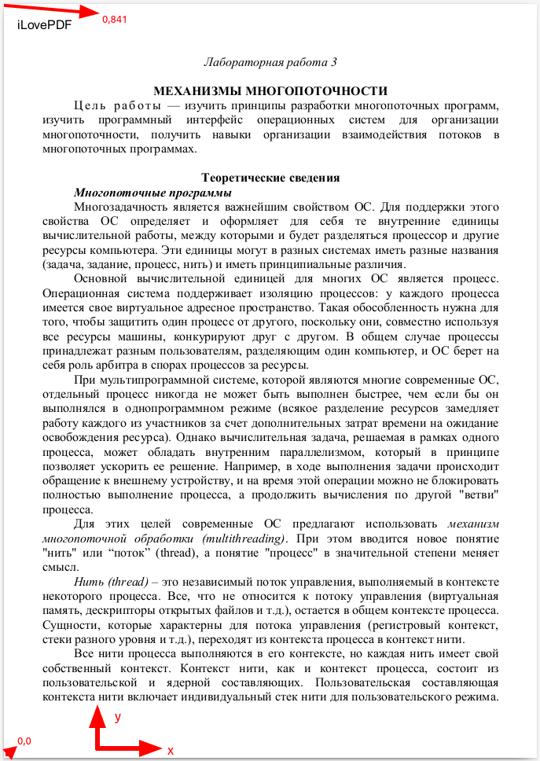

# PDF Watermark Remover

A simple command-line tool to remove watermarks from PDF files using Node.js.

## Table of Contents

- [Table of Contents](#table-of-contents)
- [Installation](#installation)
- [Usage](#usage)
- [Options](#options)
- [Examples](#examples)
- [Contributing](#contributing)
- [License](#license)

## Installation

1. Clone the repository:
```bash
git clone https://github.com/yourusername/pdf-watermark-remover.git
cd pdf-watermark-remover
```

2. Install the dependencies:
```bash
npm install
```

## Usage

To run the program, use the following command:

```bash
npm run clean -- -i [input_pdf] -o [output_pdf] -b [x1,y1,x2,y2]
```

- **`input_pdf`**: The path to the watermarked PDF file.
- **`output_pdf`**: The path where the cleaned PDF file will be saved.
- **`x1,y1,x2,y2`**: Comma-separated coordinates defining the area of the watermark. The coordinates should be specified as follows:
  - **`x1`**: Starting x-coordinate of the watermark.
  - **`y1`**: Starting y-coordinate of the watermark.
  - **`x2`**: Ending x-coordinate of the watermark.
  - **`y2`**: Ending y-coordinate of the watermark.

## Options

- **`--input`, `-i`**: Path to the watermarked PDF file.
- **`--output`, `-o`**: Path where the cleaned PDF file will be saved.
- **`--box`, `-b`**: Comma-separated coordinates of the watermark (x1,y1,x2,y2).

## Examples

To see help information, you can run:

```bash
npm run clean -- --help
```

To remove a watermark from a PDF:

```bash
npm run clean -- -i example/input.pdf -o example/output.pdf -b 0,812,550,550
```

**NOTE**

Pdf coordinate system (0,0) is positioned at bottom-left corner of the page. Y axis increases upwards and X axis increases rightwards.



## Contributing

Contributions are welcome! Please open an issue or submit a pull request for any enhancements or bug fixes.

1. Fork the repository.
2. Create your feature branch: `git checkout -b feature/MyFeature`
3. Commit your changes: `git commit -m 'Add some feature'`
4. Push to the branch: `git push origin feature/MyFeature`
5. Open a pull request.

## License

This project is licensed under the MIT License.